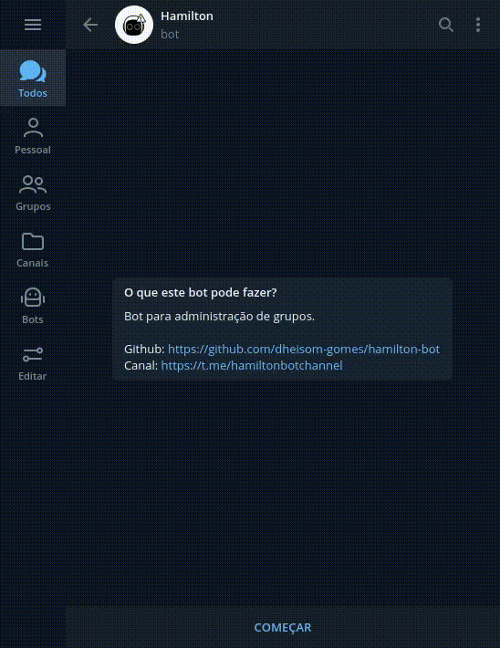

# !! Atenção !!

**Esté projeto ainda está em construção e não deve ser usado em grupos grandes.**

O código dele também só está sendo testado em sistemas linux.

# Instalação das dependências

Para instalar as dependências é simples, você só precisa executar `pip3 install -r requirements.txt`, se não for é só rodar com `sudo` no começo.

# Como configurar e rodar o bot?

Você deve ir no site [My Telegram] e abrir a aba "API Development tools" e fazer o registro de um APP para poder pegar a `api_id` e `api_hash`, depois pegue o token do seu bot no [@BotFather] para adicionar em um arquivo `ini`, crie ele da seguinte forma:

```ini
[pyrogram]
api_id = idDoSeuApp
api_hash = hashDoSeuApp
bot_token = oTokenDoBot
```

E depois fazer upload do arquivo para algum lugar que tenha link de download direto sem ir para uma página, veja um exemplo com o termbin.com no linux:

```bash
$ cat config.ini | nc termbin.com 9999
```

Com isso pronto, agora você vai precisar configurar o banco de dados e o canal o bot(para remover o comando é só apagar a função e a linha de registro no alltypes.py), para isso é preciso outro arquivo upado em um local de link direto, esse vai ser um JSON, veja como ele deve ser:

```json
{
    "channel": "Link do canal do bot",
    "mysql": {
        "user": "Nome de usuário",
        "password": "Senha dele",
        "database": "banco de dados para usar",
        "host": "Link de onde está hospedado",
        "port": "porta de conexão(opcional)"
    }
}
```

Você pode mudar de banco de dados para outro compativél com o MySQL trocando o primeiro argumento do comando `app.db = database.crub(...)`, você também pode mudar o nome da chave `mysql` mostrada aqui pelo nome do seu sistema de banco de dados, caso algum comando não seja compativél você pode editar o arquivo `bot/database.py` para corrigir, depois disso é só subir o arquivo e pegar o link, com tudo pronto, agora é hora de informar ao bot onde que estão as configurações dele, você só precisar fazer isso uma vez se não apagar os arquivos `config.ini` e `bot_config.json` que iram ser criados, vamos definir as variáveis de ambiente que o bot vai usar:

```bash
$ export CONFIG_URL="Aqui vai o link da primeira configuração, ela é do pyrogram"
$ export BOT_CONFIG="E aqui o link da configuração do bot"
$ python3 bot.py
```

E pronto! se tudo estiver certo ele vai rodar o bot e você podera usar tranquilamente.

# Bot em funcionamento



[My Telegram]: <https://my.telegram.org>
[@BotFather]: <https://t.me/BotFather>
